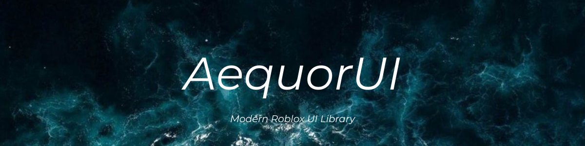

# AequorUI
A modern and clean Roblox UI library that works stably even with weak executors and bypasses powerful anti-cheats.
---
## Load
```lua
local AequorUI = loadstring(game:HttpGet("https://raw.githubusercontent.com/hnwiie/AequorUI/refs/heads/main/main.lua", true))()
```
---
## Features
**Window** — Draggable, resizable window with minimize, maximize and close support. Toggle visibility with any key.
**Tabs** — Sidebar tab system with animated selection bar, glow highlight, and built-in icons.
**Elements**
- `Paragraph` — read-only text block, auto-resizing height
- `Clipboard` — one-click copy to clipboard
- `Toggle` — on/off switch with custom colors
- `Slider` — draggable value slider with custom track, fill and dot colors
- `Dropdown` — animated dropdown menu with custom selection and glow colors
- `ColorPicker` — full HSV color picker panel with Done / Cancel
- `Button` — clickable action button with animated glow flash and arrow indicator
- `AddContainer` — hover-animated styled container row
**Themes** — 8 built-in themes: `Aqua` `Violet` `Smoke` `Scarlet` `Lemon` `Light` `Rose` `Custom`

Full custom theme support with gradient, text, boundary and glow color control.

**Custom Decorations** — Image decorations rendered on window edges.

Fully configurable position, size, rotation, transparency and tint color.

**Icon Manager** — 9 built-in icons and Custom Icon support.

---
## Quick Example
```lua
local AequorUI = loadstring(game:HttpGet("https://raw.githubusercontent.com/hnwiie/AequorUI/refs/heads/main/main.lua", true))()
local screenGui = AequorUI.GeneralUI:CreateMain(Enum.KeyCode.RightBracket, "Aqua")
local mainFrame = screenGui:WaitForChild("MainFrame")
local divider   = mainFrame:WaitForChild("Divider")
local myTabs = AequorUI.TabManager:Init(mainFrame)
local tab1, container1 = myTabs:CreateTab("Home", "Home", 1)
AequorUI.ElementManager:CreateToggle(container1, "Aimbot", "Enable aimbot.", function(state)
    print("Aimbot:", state)
end)
AequorUI.ThemeManager:SetTheme("Aqua", mainFrame)
AequorUI.ThemeManager:SetComponentColor("Selection", Color3.fromRGB(100, 200, 255), { myTabs.SelectionBar })
AequorUI.IconManager:SetIconColor(Color3.fromRGB(255, 255, 255), { tab1:WaitForChild("Icon") })
```
---
## Documentation
For full API documentation including every parameter, config option, custom themes, decorations and more — see **[Example.lua](Example.lua)**.
